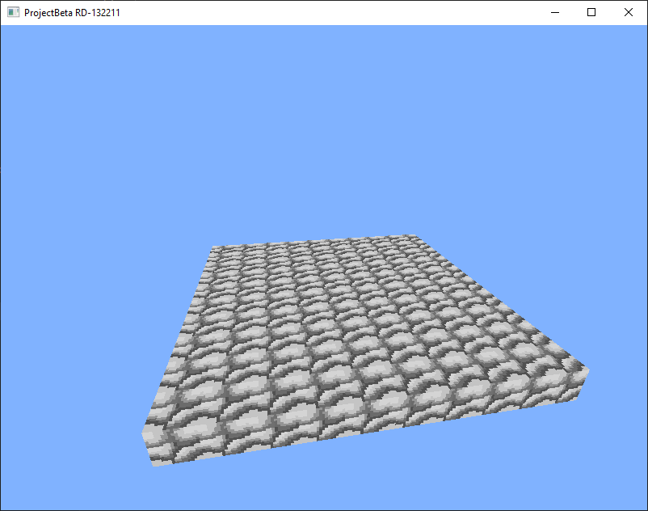

# ProjectBeta

ProjectBeta is an experimental voxel engine written in Java using LWJGL.

The goal of the project is to recreate the evolution of early sandbox engines,
similar to the earliest development stages of Minecraft.

## Current Version

RD-132211

Features:

- OpenGL rendering
- textured voxel cubes
- prototype world renderer
- executable jar builds

## Screenshots

(screenshot will go here)

## Releases

- RD-132211 — first prototype with textured cubes

