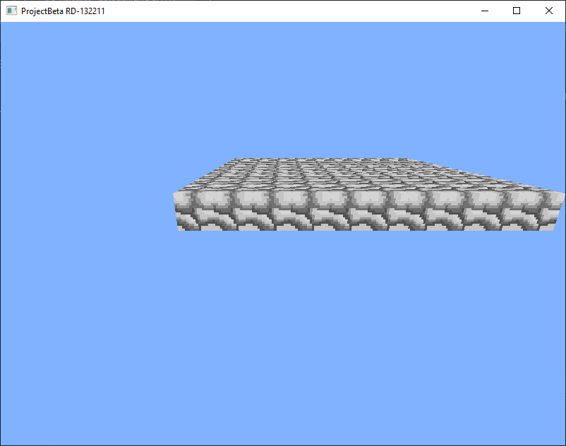

# ProjectBeta

ProjectBeta is an experimental voxel engine written in Java using LWJGL.

The goal of the project is to recreate the evolution of early sandbox engines

## Current Version

RD-132300

Features:

- OpenGL rendering
- textured voxel cubes
- prototype world renderer
- executable jar builds
- camera movement (WASD)
## Screenshots

(Latest release)

## Releases

- RD-132211 — first prototype with textured cubes
- RD-132300 — added camera movement using WASD
